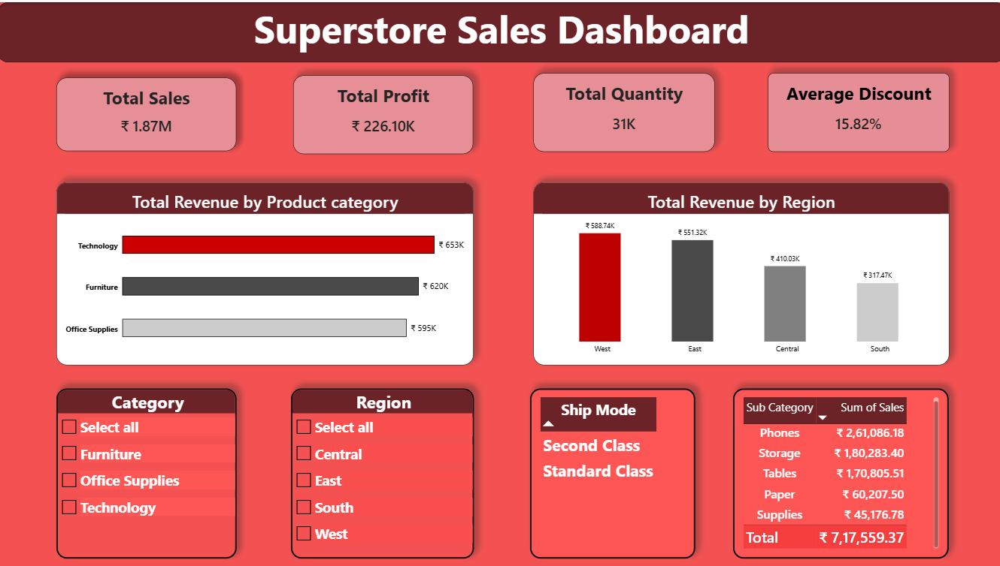

# 📊 Superstore Sales Dashboard

## Overview
The Superstore Sales Dashboard is an interactive Excel-based Business Intelligence project designed to analyze sales performance, profitability, product categories, and regional trends. The dashboard transforms raw sales data into meaningful insights through dynamic visualizations and KPI tracking.

## Dashboard Preview

## Key Features
- 💰 Total Sales Analysis (₹1.87M)
- 📈 Total Profit Tracking (₹226.10K)
- 📦 Total Quantity Sold (31K)
- 🎯 Average Discount Analysis (15.82%)
- 📊 Revenue by Product Category
- 🌍 Revenue by Region
- 🔍 Interactive Slicers for:
  - Category
  - Region
  - Ship Mode
- 📋 Sub-Category Sales Breakdown
- Dynamic and User-Friendly Dashboard Design

## Tools & Techniques Used
- Microsoft Excel
- Pivot Tables
- Pivot Charts
- Slicers
- Data Cleaning
- Conditional Formatting
- KPI Cards
- Dashboard Design
- Business Intelligence Reporting

## Business Insights
- Technology generated the highest revenue among all categories.
- West region recorded the highest sales performance.
- Phones contributed the highest sales among sub-categories.
- The dashboard helps identify profitable segments and regional opportunities.

## Project Outcomes
This project demonstrates practical skills in:
- Data Analysis
- Data Visualization
- Business Intelligence
- Dashboard Development
- Financial & Sales Analytics
- Advanced Microsoft Excel

## Author
**Kanish Singh**

---
⭐ If you found this project useful, consider giving it a star on GitHub.
